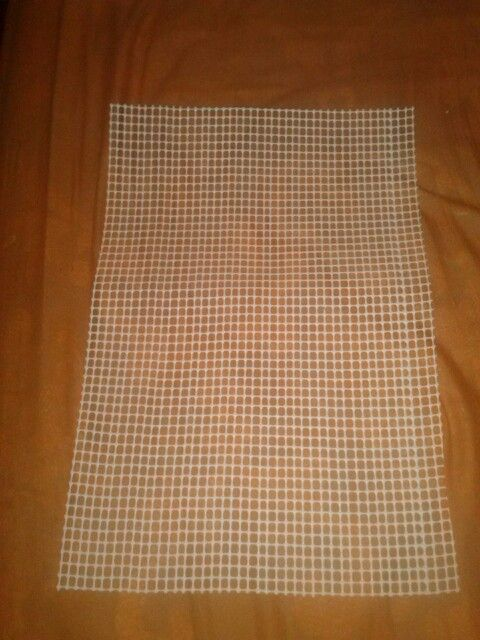

# 7272-sya.github.io
7172
<!DOCTYPE html><html lang="es">
<head>
  <meta charset="UTF-8">
  <meta name="viewport" content="width=device-width, initial-scale=1.0">
  <title>Proyecto PEC - Agua Pluvial y Residual</title>
  
</head>
<body>
  <header>
    <h1>Proyecto PEC</h1>
    
<strong>"Captación y tratamiento del agua pluvial y residual para su reuso en servicios al público con contacto directo"</strong>

  </header>  <section>
    

  

  <h2>¿Cómo inició?</h2>
    
El proyecto surgió ante la creciente crisis hídrica que afecta a nuestra comunidad. En respuesta, el grupo de cuarto semestre de la EPOANSFP decidió actuar, diseñando un filtro casero para reutilizar el agua pluvial y gris. Esta acción busca reducir el desperdicio del agua y concientizar sobre su uso responsable, utilizando materiales accesibles y restaurando un carro móvil para su implementación.
<h2>¿Quiénes han participado?</h2>
<ul>
  <li>Estudiantes del cuarto semestre, grupo II.</li>
  <li>Docentes de distintas asignaturas.</li>
  <li>Comunidad educativa y Consejo Escolar.</li>
  <li>Coordinación de Proyecto Escolar Comunitario (PEC).</li>
</ul>

Cada integrante aportó desde su área de aprendizaje: ciencias, matemáticas, humanidades, tecnología y comunicación.

<h2>10 materiales que se han ocupado</h2>
<ul>
  <li>Arena fina</li> 

  

  <li>Gravilla gruesa</li> 
  
  

  <li>Carbón activado</li> 
  
  

  <li>Cobre</li> 
  
 

  <li>Alumbre</li> 
  
  

  <li>Gasas</li> 
  
 

  <li>Algodón</li> 
  

  
  <li>Esponja verde</li>
  

  <li>Malla plástica</li> 

  

  <li>Tubo de PVC (4 in)</li> 
  
  

</ul>

<h2>¿Cuántas fases son?</h2>

El proyecto se ha desarrollado en 4 fases principales:

<ol>
  <li><strong>Diagnóstico y planeación</strong>: Identificación del problema y recursos disponibles.</li> 
  

  <li><strong>Restauración</strong>: Reparación del carro móvil (llantas, lavamanos, tinaco, estructura).</li>
  

  <li><strong>Construcción del filtro</strong>: Ensamble por capas según las propiedades fisicoquímicas.</li>
  

  <li><strong>Evaluación y resultados</strong>: Pruebas de eficiencia y caudal.</li>
</ol> 

<h2>¿Cuáles han sido los resultados hasta ahora?</h2>
<ul>
  <li>El filtro alcanzó una <strong>eficiencia del 90%</strong> en purificación del agua.</li>
  <li>El agua tratada es reutilizada para el <strong>riego de plantas</strong> en la escuela.</li>
  <li>Se comprobó que es posible <strong>mejorar la calidad del agua</strong> con materiales económicos.</li>
  <li>La comunidad escolar <strong>aprendió sobre sostenibilidad hídrica</strong> y el uso responsable del recurso.</li>
  <li>Se promueve la ciencia aplicada y el trabajo colaborativo.</li>
</ul>

  </section>  <footer>
    
Una solución comienza con la educación y el compromiso.

  </footer>
</body>

